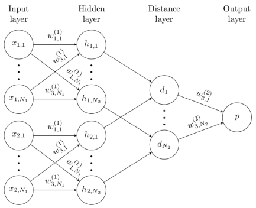

# One-shot-learning-siamese-network (Facial Verification)

## Description
In this repository, we build a siamese network for facial recognition form scratch, based on the following paper:
- paper link: [Siamese Neural Networks for One-shot Image Recognition](https://www.cs.cmu.edu/~rsalakhu/papers/oneshot1.pdf)


## What is Siamese Nuerual Network:



A Siamese neural network, also known as a twin neural network, is an artificial neural network architecture that operates on two different input vectors using the same weights. Its primary purpose is to compute comparable output vectors for these inputs. Here are the key points about Siamese networks:

- **Architecture**:
  - Consists of two identical subnetworks (twins) with shared weights.
  - Each twin processes a different input vector.
- **Comparison and Output**:
  - Twins compute output vectors for their inputs.
  - One output vector is precomputed (baseline).
  - The other output vector is compared using a distance function.
- **Applications**:
  - Face recognition, signature verification, and more.
- **Learning**:
  - Triplet loss or contrastive loss for training.

Siamese networks enable similarity comparisons between input pairs.

## How it works:

Siamese networks are designed to learn **similarity** between pairs of inputs, and they have two inputs which in our case are two flow of facial images.

One input has the flow of our facial images (Anchor), and the other input has either another image of our face (Positive) or some other person's face (Negative).

If an anchor image and a positive image are fed to the network, we get class (1) in the outpout. But, if we fed an anchor image and negative image to the network we get class (0) in the outpout.

| Input 1  | Input 2   | output (class)   |
|-------------- | -------------- | -------------- |
|     |      | ( 1 )     |
|     |      | ( 0 )     |


1. **Siamese Networks**:
   - Siamese networks are designed to learn **similarity** between pairs of inputs. In your case, these inputs are face images.
   - The network architecture consists of **two identical branches** (often called "twins") that share weights. Each branch processes one input image.
   - The goal is to learn a **feature representation** for each input image such that similar images have similar feature vectors.

2. **Training Process**:
   - You mentioned using **anchor images** (your own face images) and **positive images** (also your face images). These form **positive pairs**.
   - For **negative pairs**, you use random people's face images.
   - During training, the network learns to **embed** these images into a common feature space.
   - The **contrastive loss** or **triplet loss** function is commonly used to train Siamese networks.

3. **Positive Pairs**:
   - The network computes feature vectors for anchor and positive images.
   - The **cosine similarity** or **Euclidean distance** between these vectors quantifies their similarity.
   - The network aims to minimize this similarity for positive pairs.

4. **Negative Pairs**:
   - For negative pairs (anchor vs. random people's faces), the network computes feature vectors.
   - The network aims to **maximize the similarity** between anchor and negative images (i.e., make them dissimilar).

5. **Loss Function**:
   - During training, the network minimizes the **contrastive loss** or **triplet loss**.
   - Contrastive loss encourages positive pairs to be close in feature space and negative pairs to be far apart.
   - Triplet loss enforces that the distance between anchor-positive pair is smaller than anchor-negative pair.

6. **Testing Phase**:
   - After training, during testing, you feed an **unknown face image** (e.g., a verification scenario).
   - The network computes its feature vector.
   - To verify if it matches a known person, compare the feature vector with the anchor's feature vector.
   - If the similarity exceeds a threshold, the faces are considered a match.

7. **Benefits**:
   - Siamese networks are powerful for **one-shot learning** (few examples per class).
   - They work well when labeled data is scarce (as they don't require large labeled datasets).

Siamese networks learn to **embed** images into a feature space where similarity reflects the underlying relationship.


## Code (notebook)

Open the notebook in colab:
[colab](https://)


## Dataset
We need three type of data to train and test our siamese network:

- Anchor images: images of our face
- Positive images: also images of our face
- Nagativa images: random images of other people's face. [link](https://vis-www.cs.umass.edu/lfw/#download) ---
[download](http://vis-www.cs.umass.edu/lfw/lfw.tgz)

for the Anchor and Positiva images: you can use the python code in  ``` take_picures.py ``` file.

You can also use the following link to dowload all in once: 
[download](https://drive.google.com/drive/folders/1-4-iqBk2UaSpI1yruVGeberDd19LOg7s?usp=sharing) 

